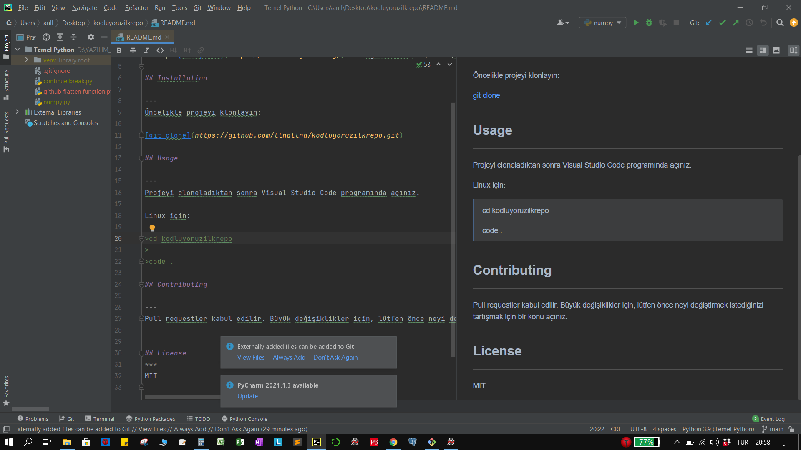

# Kodluyoruz İlk Repo

---
Bu repo [koluyoruz](https://www.kodluyoruz.org/) Git Eğitiminde oluşturduğum ilk repo. İçerisinde bir adet RADME sodyası, bir adet index.html barındırıyor.
 
 

"""Ne zor oldu bunu eklemek, meger aynı dosyada olması gerekiyormus. :(
"""

## Installation

---
Öncelikle projeyi klonlayın:

[git clone](https://github.com/llnallna/kodluyoruzilkrepo.git)

## Usage

---
Projeyi cloneladıktan sonra Visual Studio Code programında açınız.

Linux için:

>cd kodluyoruzilkrepo
> 
>code .

## Contributing 

---
Pull requestler kabul edilir. Büyük değişiklikler için, lütfen önce neyi değiştirmek istediğinizi tartışmak için bir konu açınız.

## License
***
MIT

### Kontrol

* Markdown dosyanızın içine projemizin bir resmini koyun.  +
- Repomuzun içine bir adet index.html dosyası oluşturun.   +
* En sonunda yaptığınız değişiklikleri ekleyin, commitleyin ve gönderin. +

